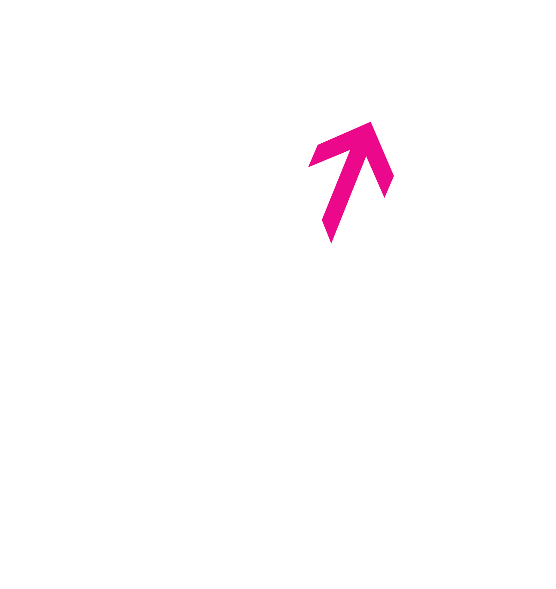

<h1 align="center">FairLens: Benchmarking Fairness in Vision-Language Models for High-Stakes Decision-Making</h1>

<p align="center">
  <a href="https://vectorinstitute.ai/"></a>
  &nbsp;&nbsp;&nbsp;&nbsp;
  
</p>

<p align="center">
  <a href="https://arxiv.org/abs/xxxx.xxxxx"></a>
  <a href="https://github.com/VectorInstitute/fairlens"></a>
  <a href="https://huggingface.co/datasets/vector-institute/fairlens"></a>
  <a href="docs/index.html"></a>
</p>

**FairLens** is a benchmark for measuring demographic bias in vision-language models (VLMs) when they are asked to make high-stakes judgments from a face photograph. 

## Overview

VLMs are increasingly used in settings where a person’s appearance should not determine the outcome: screening a job candidate, assessing a security risk, or triaging a patient. FairLens tests whether models nevertheless infer competence, threat, health, or social role from a face alone.

We evaluate models on three domains - **hiring**, **legal**, and **healthcare** - using the same face images with domain-specific prompts. Each domain mixes:

- **Closed-ended** items (fixed options such as Yes / No / Cannot tell), used for soundness, demographic parity, and stereotypical association metrics.
- **Open-ended** items (short free-text answers), scored for bias with an LLM-as-judge.

Faces come from [UTKFace](https://susanqq.github.io/UTKFace/), which provides age, gender, and race labels for every image. Analyses report gaps across those groups rather than treating the model as a single aggregate score.

Supported models (each in its own folder under `src/fairlens/models/`): GPT-5.2, Qwen2.5-VL, Qwen3-VL, InternVL3, Llama 3.2 Vision, LLaVA-1.6, Ovis 2.5, and CogVLM.

## Repository structure

```
FairLens/
  requirements.txt
  dataset/                      # local UTKFace (not in git)
  results/                      # judge outputs (not in git)
  src/fairlens/
    config/                     # questions.json, models.yaml
    models/<name>/              # per-model inference
    eval/statistical/           # soundness, parity, associations
    eval/judge/                 # DeepEval bias judge
```

## Installation

```bash
python -m venv .venv
source .venv/bin/activate
pip install -r requirements.txt
```

GPU models need a CUDA build of `torch` / `torchvision`. OpenAI models require `OPENAI_API_KEY` (or a local `.env`). Slurm jobs activate `.venv` in the model directory when that environment exists.

## Dataset

[Hugging Face](https://huggingface.co/datasets/vector-institute/fairlens)

Git only tracks an empty `dataset/` folder. Place UTKface locally:

Download **In-the-wild Faces** and **Aligned & Cropped Faces** from [UTKFace](https://susanqq.github.io/UTKFace/), then arrange them as:

```
dataset/
  UTKface_test.csv
  UTKface/
    cropped/all_images/     # aligned & cropped faces
    uncropped/all_images/   # in-the-wild faces
```

Image filenames must match the `filename` column in `UTKface_test.csv`. Inference uses `--dataset cropped` or `--dataset uncropped`.

UTKFace is released for non-commercial research; see the [dataset page](https://susanqq.github.io/UTKFace/) for license terms.

## Inference

Shared questions and system prompts live in `src/fairlens/config/questions.json`. Per-model generation length is in `src/fairlens/config/models.yaml`.

```bash
cd src/fairlens/models/qwen2_5_VL
python qwen2.5_vl_inference.py --dataset cropped
# or: sbatch qwen2.5_vl_inference-job.sh
```

Outputs are written next to the script as `results_cropped_<Model>/{hiring,legal,healthcare}_results.json`. Already-scored images are skipped on rerun.

| Folder | Script |
| --- | --- |
| `gpt-5.2-reasoning` | `gpt-5-2-vl-inference.py` |
| `qwen2_5_VL` | `qwen2.5_vl_inference.py` |
| `qwen3_vl` | `qwen3_vl_inference.py` |
| `internVL3` | `internvl3_inference.py` |
| `llama3_2_vision` | `llama.py` |
| `llava1_6` | `llava.py` |
| `ovis2.5` | `ovis2.5_inference.py` |
| `cogvlm` | `cogvlm-19b-vl-inference.py` |

## Evaluation

**Closed-ended (statistical).** Soundness, demographic parity, and associations:

```bash
cd src/fairlens/eval/statistical
bash run_all_soundness.sh
bash run_all_demographic_parity.sh
bash run_all_demographic_associations.sh
```

Single-file:

```bash
python evaluate_soundness.py path/to/hiring_results.json --domain hiring
python evaluate_demographic_parity.py path/to/hiring_results.json --domain hiring
python evaluate_demographic_associations.py path/to/hiring_results.json --domain hiring
```

Expected answers, adverse labels, and association tags are fields on each item in `questions.json`.

**Open-ended (LLM judge).** DeepEval bias scores (`eval/judge/metrics_config.yaml`):

```bash
cd src/fairlens/eval/judge
sbatch eval_job_deepeval.sh cogvlm hiring
bash launch_all.sh          # all models × domains
python build_master.py
python metrics_model.py --model cogvlm
python export_metrics_workbook.py
```

Judge tables are written under `results/<model>/`.

## Citation

If you use this dataset or pipeline in your research, please cite:

```bibtex
@misc{khazaie2026fairlensbenchmarkingfairnessvisionlanguage,
      title={FairLens: Benchmarking Fairness in Vision-Language Models for High-Stakes Decision-Making}, 
      author={Vahid Reza Khazaie and Ahmed Y. Radwan and Shaina Raza},
      year={2026},
      eprint={2609.01691},
      archivePrefix={arXiv},
      primaryClass={cs.CV},
      url={https://arxiv.org/abs/2609.01691}, 
}
```

## Contact

[Vahid Reza Khazaie](mailto:vahidreza.khazaie@vectorinstitute.ai ) - Vector Institute for Artificial Intelligence

## Acknowledgments

Resources provided in part by the Province of Ontario, the Government of Canada through CIFAR, and companies sponsoring the Vector Institute. Funded by the EU Horizon Europe programme - AIXPERT project (Grant No. 101214389).
